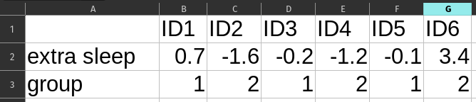
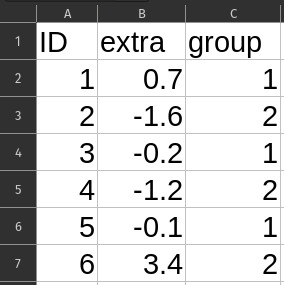

# What's on this page?

The overall goal of this reading is to introduce some fundamental concepts that we will expand on throughout the course.  In other words, the goal is to get us started off on some common ground.

I will call attention to key terminology with margin notes. I will also ramble about side thoughts in margin notes as well. Sometimes the margin notes will be numbered,[^sidenote] like footnotes that connect to a specific part of the main text.  Sometimes they're unnumbered, just hanging out whenever you feel like reading them.

::: column-margin
This is a margin note.
:::

[^sidenote]: This is a numbered side-note.

Interspersed in the text below are some Knowledge Checks for quizzing yourself. I encourage you to attempt to answer these as you encounter them, to help force yourself to process and understand the material more thorougly. After working through this entire page, make sure you answer these questions in the Unit 1 Knowledge Check Quiz on ELMS. I recommend writing your answers down in notes as you work through this page, and then just referring to your notes to review and provide answers when you take the quiz on ELMS. This is built-in way for you to review the material as you go.

If you have questions, reach out on the course Discord, and/or come to an Open Discussion Zoom session.

Happy reading!

# Why statistics?

Before you start a new undertaking, it's always good to revisit the question of "why", even if you think the answer is obvious (*spoiler*: there are almost always non-obvious things to think about). This is a course about *statistics*, so why should we bother learning about statistics?

::: column-margin

There's another usage of the word "data" to represent *any* kind of digitally-recorded value. That is, all the 0's and 1's stored in a computer are all "data." We use this sense of the word when we talk about our phone or internet plans, download rates, etc. 

However, this is not exactly what we mean when we talk about "data" in the statistical or analysis sense. We clearly had data analysis before computers existed! And conversely, not all "computer data" is data we can analyze with statistics.

The point for us here is to remember that we will use the word "data" in this course as defined below, but other people might use the term data to just talk about what is stored, transmitted, and manipulated by computers. Isn't language fun?

:::

As with many good questions, when we consider them carefully, they lead to other questions. We might say something like, "statistics is an important part of data analysis," and this is true, but it also raises another question, "what's data analysis?", and yet another, "what's *data*?"

So let's take that as our starting point: **What is data?**

Take a few seconds to think about it, and write down or type out a list of things you think count as data.  Yes, I'm serious, just do it.  When you look at the list, what do you see? What seems to be in common? What isn't? As I go through my definition below, think about whether you agree, and whether you think everything on your list counts as data under this definition. Should we make some alterations to the definition? These are all great things to discuss.

## Defining *data*

::: column-margin

**Excursion**: is the word "data" plural or singular? Should we say, "data **is** important," or "data **are** important"? Modern usage (including my own use) has tended to make "data" what is called a *mass noun*, like "water" or "sand." For example, if you were on the beach, you would say something like "that's a lot of water" or "that's a lot of sand", not "that's a lot of waters" or "that's a lot of sands", even though it would be fine to say "that's a lot of clouds" but not "that's a lot of cloud." And it would be natural to ask "how much sand is in that container?" not "how many sands are in that container?", in contrast to "how many clouds are in the sky?" (fine) vs. "how much cloud is in the sky?" (bad). For me, "data" is like "sand" (mass noun), not "clouds" (count noun).

But there are also people who remind us that originally, the word "datum" meant "single value" and that the plural of "datum" is "data," so we should say things like "those data are very meaningful," not "that data is very meaningful." However, I have never once heard anyone ask, "how many data are on that hard drive?", so I'm skeptical about the commitment of the count noun people. In practice, use either (I will tend to use the mass noun), until you find an editor who wants to nitpick about "data are" instead of "data is", and then you can decide if you'd rather argue about mass nouns, or just smile, nod, and change it the way they want you to.

I'm just warning you that "data are" snobs exist.

:::

My definition has two parts. First, data represents a set of *values*. Those values can be numerical, alphabetical, or really any kind of symbolic value (a value represented by a symbol). 

The crucial second part of the definition is that data must carry some kind of *meaning* or *information*. In turn, both of those words can have some pretty technical definitions, but we won't go down those rabbit holes for now. The point is that you could find a big list of numbers somewhere, but it's not really "data" until those numbers *mean* something, like if you found out that they were a set of financial records or game scores or medical measurements or something.

Put these together, and we can say something like, "data is a set of meaningful values," which is almost there, but not quite. Because think about it a little bit: if someone gave you a big file full of medical data, would we automatically say, "oh, that's a lot of valuable meaning in there"? If it's just a big collection of pulse readings without any connection to patients or other data, then probably not.

## Data analysis

Here's where we can bring in the idea of *data analysis*. Data may have some meaning, but I would argue that that meaning is not *accessible* without data analysis. We might also tweak our definition a bit to say something like "data is a set of values that *carry* meaning", with the corollary that data analysis is necessary in order to *extract* meaning from data.

[Clive Humby](https://en.wikipedia.org/wiki/Clive_Humby) famously said in 2006, "data is the new oil!" This metaphor has a lot of interesting facets if you think about it, and I think the analogy between data as *unrefined* oil is apt here. Crude oil is of course necessary for most of the cars we drive, but only after a great deal of processing. The same with data: there may or may not be valuable information in the data, but only good analysis can reveal it or make it accessible or useable.

In this course, we will learn and practice both *exploratory* and *inferential* data analysis.[^confirmatory] These types of analysis are best done together, or are best considered as two useful but complementary approaches. We will discuss more about these as we go through the course, but as an initial working definition, *exploratory* analysis is a good first step, where we start to build an understanding of a data set, and start to develop questions about it. In contrast, *inferential* analysis is what we do when we would like to be a little more certain in what we can and can't conclude based on a data set.

[^confirmatory]: It is also common for people to contrast "exploratory" with "confirmatory." I'm going to avoid that term because I see it as more narrow, but the overall gist is the same.

## Embracing uncertainty

We said the "c-word" ("certain"), so now it's time to discuss its complement: *uncertainty*. Because this is what the core of statistics is really about. Let's imagine a situation (unfortunately not that hard to imagine) in which there is a terrible new disease, and we would very much like to have a treatment that works to improve people's outcomes. How do we go about doing this?

Well, we try out treatments and we collect data. We take measurements about what we try, who we try it on, and what happens after people try our treatments. And let's say that when I try a treatment on 10 people, 8 of them recover completely. How *certain* can I be that my treatment helped? The numbers sound encouraging, but what if I knew that out of 1,000 people who didn't get any treatment at all, 780 of them recovered completely? If I just extraploated my numbers (where 8 out of 10 people recovered), I might expect 800 people to recover out of 1,000. Can I say that my treatment would have saved 20 people out of 1,000? Can I say that with any certainty?

It turns out that in the real world, there are many random and unknown factors present in virtually everything we observe. And sometimes, "dumb luck" just happens. If I flip a coin 10 times, on average I expect 5 heads and 5 tails, but what if I got 8 heads? Is that a sign that there's something wrong with the coin, or was it just lucky/unlucky that I got 8 heads out of 10?

These are not esoteric questions of strange and unusual happenings. In the real world, we are perpetually surrounded by uncertainty. This can of course be worrisome and we often wish we had more certainty. But *pretending* to have certainty where you do not is much more problematic. Think about how many people seem absolutely certain about flawed ideas or misinformation they may see online. Confidence is a nice personal quality, but *overconfidence* in decision-making is just a way to make worse decisions.

However, the situation is not hopeless. People frequently mistake the mere presence of *any* uncertainty with the idea that there's *zero* certainty. This not true. Being 90% certain of an outcome is not 100%, but it's a lot more than being only 10% certain!

So what can we do?  My personal belief is that the best we can do is to **embrace uncertainty**. What does that mean? It means that we start by accepting that uncertainty is the rule, not the exception, and that our goal is to *understand* uncertainty, and do our best to *quantify* it, so that we can make the best decisions we can. When you accept that uncertainty exists, it changes your outlook to look for things that will help you *decrease* your uncertainty, without being under the illusion that you will ever get to *zero* uncertainty.

## Why statistics: the beginnings of an answer

The good news is that there is an entire field devoted to better understanding and quantifying uncertainty, and this is what we know as *statistics*. When I mentioned "inferential analysis" above, I mean using statistics to quantify how much uncertainty we have and to help us identify what our "best bets" are.[^stats] 

Let's go back to the medical data example. Maybe we have a data set with a bunch of values of different kinds, linked in different ways. For example, maybe we have a list of patient IDs, blood pressure measurements, and the time and date of each measurement. This meets our definition of data, because this set of measurements *carries meaning*, because we know what the measurements represent and how they relate to each other. But this data doesn't *tell* us anything just by existing.[^speaking] Perhaps if we start to explore this data, we could find patterns that help us identify people with a higher-than-expected risk for a particular disease or medical outcome.

[^stats]: But also, once again, words and terms can end up with different meanings. In some usages, the word "statistic" can really just mean any kind of computed value. For example, the minimum, maximum, mean, median, etc. of a set of values are often called "descriptive statistics." But this is not the same as what we mean by "statistical analysis," which is more about how to draw conclusions. As a field, statistics has a *lot* of unfortunately confusing terms. It's unfortunate because we have to learn to live with them, at least when we talk to statisticians.

[^speaking]: This is why I hate the phrase "let the data speak for itself." Data doesn't say *anything* without an analysis, and people have to make choices when it comes to deciding exactly what to analyze and how.

But if we are just beginning to investigate some data, this is still exploratory. If you look long enough in any data set, you may be able to find *some* kind of pattern, because humans are inherently good at perceiving (or thinking they perceive) patterns. At the end of the day, we would like to be able to properly *infer* something from the pattern, so that we can make better decisions. Back to our example, maybe we find out that there's an association between a group of people and a disease, but what we really want is to know, "okay, if you're a person in this group, does that raise your risk of this disease, independent of other factors?" In other words, can we use this information to make accurate predictions? How certain can we be that being in this group raises your risk? How much is the risk actually increased? Is it a tiny increase in risk, or does it all but guarantee who will be affected?

This is the role of statistics.

> Valid statistical methods are mathematical methods that can help support drawing valid conclusions or making valid decisions by quantifying uncertainty. 

Notice I said *valid* statistical methods. Sloppy stats lead to sloppy or invalid conclusions. The author Tyler Vigen maintains this hilarious site of "spurious correlations."[^spuriousAI]

[^spuriousAI]:
And it's kind of hilarious that now Tyler has used generative AI try to make up a "reason" for why these spurious correlations exist. The layers of spurious BS are amazing!

> <https://tylervigen.com/spurious-correlations>

These are all examples of things that, if you just blindly run statistics on them, show very high correlations with each other, meaning that changes in one coincide with changes in the other. But it takes serious thought to help figure out which correlations are *coincidences* (aka "spurious"), and which are meaningful relationships. This is a reminder that statistics are not a substitute for thinking! Statistical methods are best used as a *complement* to good thinking.

So it may be true that the frequency of Google searches for 'how to hide a body' significantly correlates with the number of Bachelor's degrees awarded in Library Science,[^spuriouslibrary] and the statistics help quantify how close that relationship is, but serious thought is needed to help make sure we are not blindly trusting stats, at least without a lot more careful work.

[^spuriouslibrary]: <https://tylervigen.com/spurious/correlation/1840_bachelors-degrees-awarded-in-library-science_correlates-with_google-searches-for-how-to-hide-a-body>

# Interim recap

So to briefly sum up, here's what we've outlined so far:

1. Data is valuable, because it consists of *values* that carry some kind of *meaning* that relates to something we might care about.
2. But data doesn't tell you anything on its own, for that you need *data analysis*.
3. Data analysis can be broadly broken into two (deeply intertwined) phases: *exploratory* analysis and *inferential* analysis.
4. Exploratory analysis can help you identify patterns, but there is always a level of uncertainty in those patterns or what we can conclude from those patterns.
5. Statistical methods help us to perform inferential analysis that takes uncertainty into account.
6. Therefore, statistics are important as a crucial component of making valid decisions using data.
7. However, statistical methods are a *complement* to careful, reasoned thinking about a problem, not a *substitute*.

# Knowledge Check 1: what counts as data?

Which of the following fit our definition of "data" so far? Why or why not?

- Set of GPS coordinates indicating your phone's position over time
- Spreadsheet of values recorded in a scientific study, with labels indicating what the values refer to
- JSON file describing the structure of a website
- Summary report of conclusions from a scientific study
- Summary of a book generated by an AI
- JSON file with values stored for each of a website's users
- Supermarket receipt
- List of numbers in an unknown computer file
- Logs of running times, distances, and dates hand-written in a personal notebook

# The shape of data

Now that we've talked about what data is and what we want to do with it, we need to talk more specifically about the shapes it comes in, because in order to be able to work with data and manipulate it, we need some concepts and terms to help guide us.

## Variables

The most basic unit of data that we will deal with is the *variable*. A variable is a single *dimension* of our data, representing just one aspect or type of measurement. So if we have a bunch of medical records in a data set, one variable may be the weights of patients, another might be resting heart rates, another might be systolic blood pressure, and so on. These are called variables because they *vary* in our data, in contrast with *constants*, which don't vary. We typically don't even think of constants as "data", precisely because they are 100% predictable (or otherwise determined), but we will see in later units how the concept of a constant is an important part of some statistical models.

::: column-margin

This is another case where we will have to deal with some ambiguity, or rather, homophony. When we work with computer languages like R, we talk about *variables* in a different way, although in practice there is a bit of overlap. In a programming language, a *variable* is some kind of symbol (usually some alphanumeric characters) that acts as a name or reference for an object in computer memory. That is, we assign an object to a variable, meaning we give it a name, so we can refer back to it later.

Here, when we are talking about variables in a *statistical* sense, we mean something else.

:::

But variables are where the action is, so to speak. They are the values we take pains to collect, and they are the things we are trying to predict. One key point is that a given variable is information along a certain *scale*, a single dimension. A collection of data that includes different kinds of information, like height, weight, and blood sugar levels, is not a single variable, but multiple.

::: column-margin
Note that just having a variable doesn't tell you *how much* data you have. A variable with one observation is still (in theory) a variable, though you may need more than one observation to do anything meaningful with it.
:::

# Knowledge Check 2: examples of variables

Which of the following are examples of *variables* in our statistical sense?

- dollar amounts
- a spreadsheet of financial data
- a list of US States
- a SQL table from a database
- a list of points scored for each player in a basketball game
- the height, weight, and blood pressure of a patient
- Amazon product ratings
- categorical "true/false" responses on a survey
- the number 1

# Types of variables

One of the important things to know about a variable when we start to analyze is what type of information it contains. Depending on what type of data it represents, some methods for analysis may or may not be appropriate or misleading.

We can first categorize data roughly into *numeric* vs. *non-numeric* data. Sometimes the line can blur between these, but this is usually the first consideration. Then, if we consider just numeric data first, that also breaks down into some different types:

- Continuous: like the real number line
- Interval: like the set of integers
- Ordinal: like a ranking
- Nominal: standing in for unordered categories

Let's talk about each of these in turn.

## Continuous data

Continuous numerical data refers to the idea that within the ranges of data, essentially *any* numeric value is possible, up to the number of digits of measurement precision. One example might be weight, where given a sensitive enough scale, you could get potentially any value along the number line.

In practice, virtually any data that is represented down to decimal levels is treated as continuous without any problem. However, people often treat data that is maybe not *strictly* continuous as still "continuous enough." This is often fine, but sometimes not, and it's crucial to always keep in mind exactly what kind of data you have, as you consider ways to analyze it.

## Interval data

One type of data that might be described as "almost continuous, but not really" is called *interval* data. It's called *interval* because the idea is that the distance between values (the size of *intervals* between values) is meaningful and constant at different parts of the scale. To be clear, continuous data is **also** interval data, so these labels aren't exclusive. But we usually reserve the term *interval data* to talk about data which may or may not be continuous, but can still be treated as having even intervals.

One example would be the number of children in a home. You can only have an integer number of children in a given home, and it's an interval quantity, because the difference between 1 and 2 children is the same as the difference between 4 and 5 children: namely 1 child. But as the old joke goes, when you do things like take an average over all households in a population and you come up with something like "the average household has 1.4 children", it becomes clear that the number of children is definitely not a *continuous* measure in reality!

::: column-margin

Now of course, if you have experience with children in households, you might balk at the idea that going from one to two children is the same as going from four to five. This is exactly the kind of thing to consider when thinking about how to analyze your data! For example, clothing costs for households may not scale in a regular way depending on the number of children, because households with more children might re-use clothes more as "hand-me-downs" between children. The point here is that deciding on whether a variable is continuous or interval or something else may change depending on what you want to use it for.

:::

## Ordinal data

You can think of the *interval* data type as a "less strict" type than *continous*. Loosening things up even more is when we treat numeric data as merely *ordinal*. These are numbers that rank different values (they have an *order*), but there is no expectation that the values have the *interval* property. In other words, differences between different values may not be equivalent.

One example is rankings in competitions. Imagine taking three people from a university tennis team and ranking them 1, 2, and 3. Maybe they are not all that different, but maybe the 1st and 2nd ranked players are closer to each other than the 3rd. Then to drive the point home, imagine adding Novak Djokovic to the mix. Now the distance between the 1 and 2 rankings is hugely different than the distance between the 2 and 3 or 3 and 4 rankings (unless this is an enormously talented college team).

Another very common example in data analysis are ratings such as so-called "Likert" ratings from surveys.[^likert] These sometime have words associated with them, like "strongly agree" through "strongly disagree", or they may just be of the kind, "rate this on a scale from 1 to 5". Because these are judgments, and people have all sort of preconceived or other notions about what these ratings mean, they are very unlikely to be *interval* data. For example, it may be erroneous to assume the difference between a 5-star and a 4-star review is the same as the difference between a 4-star and a 3-star review.  Clearly 5 is better than 4 and 4 is better than 3, but *how much better* may not be constant. This is the hallmark of *ordinal* data.

[^likert]: The same typically holds true for other kinds of rating systems, like "star" rating systems like movie reviews, game reviews, Uber reviews, Yelp reviews, etc.

## Nominal data

Finally, we have the type of data where there are differences between the values, but there's no inherent ranking. If these are numeric data, it's usually because the numbers just stand in for category labels, and it's arbitrary which numbers go with which categories.

One example might be eye color in a data base of physical features of people. There is no obvious sense that "brown eyes" is a higher or lower value than "blue eyes," they're just different.[^eyes] To further illustrate, imagine a data base that recorded brown eyes as 1, green eyes as 2, and blue eyes as 3. Then imagine that the data consisted of 20 brown-eyed people, 5 green-eyed people, and 20 blue-eyed people. If you treated this as interval data or (heavens forbid) continuous data, then it might be reasonable to calculate the "average" eye color. If you then computed the average of these numeric values, you would end up with an average of 2, meaning green-eyed people, even though that group was the least numerous. Hopefully you can see how this would be problematic. This is actually a good rule-of-thumb thought experiment: if you try to do math like taking an average or computing a difference, and the result doesn't make any sense, then there's a chance that the data is actually categorical, even if it's represented by numbers in your data set.

[^eyes]: Can you think of any cases that might be a counter-example? What kind of data or analysis would you need to be doing in order to treat, say, brown, green, and blue eyes as ordinal? What would be determining the order?

Note that nominal data is also often called "categorical" data, but strictly speaking, ordinal data is also categorical. In other words, when you see people talk about "categorical data", they usually mean *nominal*, so sometimes you might need to clarify.

## Non-numeric data

Non-numeric data really doesn't introduce any new categories, but rather just represents a subset of the above categories. Often non-numeric data is nominal (aka categorical), but sometimes it can be ordinal, like the Likert response categories such as "strongly agree", "somewhat agree", "somewhat disagree", "somewhat agree".

So ultimately, the choice between numeric and non-numeric is a matter of how the data is coded or represented. We can always choose to take non-numeric data and use numbers to stand in for the different (non-numeric) values. What's more important is that we keep in mind that we don't treat all numeric data as continuous or even interval; it's always important to think about what type of data your variable represents before continuing your analysis.

Now, let's talk about what happens when you have multiple variables in a data set. But first, a couple of Knowledge Checks.

# Knowledge Check 3: numeric vs. non-numeric data

For each of the following four types of data, indicate whether this data can be numeric, categorical, or both.

- Continuous
- Interval
- Ordinal
- Nominal

# Knowledge Check 4: data type examples

For each of the examples of data variables below, indicate whether this data is most likely to be continuous, interval, ordinal, or nominal.

1. rankings of the top 10 purchased video games on Steam this week
2. list of countries
3. amount of time spent looking at different parts of a website in a usability study
4. counts of clicks on different parts of a website in a usability study
5. customer satisfaction ratings from 1 to 100
6. ratings from participants of a survey whether they "agree", "disagree", or "neither agree nor disagree" with different statements
7. distances recorded for throws in a shot-put event
8. exact dollar amounts of income for a random selection of 1,000 people
9. a list of UID numbers for students in a survey
10. number of views for 1,000 randomly selected TikTok videos
11. names of top ten grossing movies
12. points scored in each game of a baseball team's season

# Data Frames

In truth, while you may be able to do some useful things with a single variable, most of the really interesting stuff happens when you have more than one variable. But what shape does that take?

One of the most useful and ubiquitous shapes that data comes in is something called a "data frame." There are other names for this, like "tables" in a data base context, or a spreadsheet in a program like Excel, but the idea is simple: data is in a rectangular format, with rows and columns, such that every row has a value (or "cell") for every column, and every column has a value for every row.

Furthermore by convention, the columns are *variables*, and the rows are *records* or *observations*. For example, consider a medical data base where we had three variables: height, weight, and (average) resting heart rate. If we had some way to link these, for example we had each of these values for a number of patients, then we have a data frame: a column for each variable, plus a column with a patient-identification variable (like a name or ID number), and every row represents the data for a single patient.

What if we added time to this, where we had multiple measurements over time across multiple patients? This is where things start to get interesting and choices have to be made. But one way to represent this data might be a data frame that includes an additional column, representing a "time" variable. Now patients would be represented on multiple rows, so a row is no longer a "patient", but rather something like "a patient at a specific time".

But the real answer is that while there are some basic conventions and principles, like representing variables in columns and observations/records in rows, there are often lots of different shapes that one could arrange a given data set into, depending on your purposes. We will see examples of that as we continue in the course, and it is why the ability to re-format and re-shape your data is a critical skill to develop as a data analyst.

For now, we will focus on data frames and use their implementation in R to capture our data, and we will hold on to the idea that columns roughly correspond to variables, and rows roughly correspond to a set of linked observations.

# Knowledge Check 5: data frame shapes

Imagine you find a table of data from a sleep study that recorded treatment type and change in sleep time for each person in the study.  Which of these two tables better fits the conventional arrangement of a data frame?

{fig-alt="Table A" fig-align="left"}

{fig-alt="Table B" fig-align="left"}

# First steps in Exploratory Data Analysis

With these preliminary goals, concepts, and definitions in mind, we can start to think about how to approach exploratory data analysis.

## Finding good questions

The person who coined the term "exploratory data analysis" was [John Tukey](https://en.wikipedia.org/wiki/John_Tukey), a famous 20th-century statistician. Tukey was extremely influential in many ways, including bringing back the use of graphics to help with statistical analysis, especially in exploratory analysis. He is also widely credited with coining the term "bit" for the basic unit of computing memory/storage, and he has the first published use of the word "software."

But for our purposes in this course, Tukey leaves behind a series of observations and ideas that help guide us through the exploratory data analysis process. His analogy for the concepts of *exploratory* vs. *inferential* (he used the word *confirmatory*) was roughly:

> Exploratory analysis is like good detective work: looking for clues, examining assumptions, exploring possibilities, and assembling evidence. Inferential analysis is like a court trial: weighing the evidence and making a decision based on the strength of that evidence.

But before we dive into discussing the detective work, Tukey also provides us with reason for a little humilty and caution:

> The combination of some data and an aching desire for an answer does not ensure that a reasonable answer can be extracted from a given body of data. -- John Tukey

To paraphrase: just because you *really want* to find an answer to a question and you have some data -- even a LOT -- of data, there may not be a reasonable answer to find. To take the detective analogy, just because there's a scene doesn't mean there was a crime!

This is good, sober advice to help us keep from going too astray just because we are committed to finding something in a data set. But it also subtly emphasizes the importance of questions. Another quote that nicely complements this one:

> An approximate answer to the right problem is worth a good deal more than an exact answer to an approximate problem. -- John Tukey

Paraphrase: getting the right questions and exploring the right problems is more important than getting "perfect" answers to unimportant or misunderstood questions/problems.

Here's an example in terms of modern app development that illustrates both of these ideas. Imagine a hypothetical app called SayWhat that sells itself as a language-learning app. The developers of that app are constantly adjusting and working on it. But how do they decide what is a "good" change to the app? They surely have a huge amount of data to work with. So shouldn't they be able to use that data to assess whether one version of the app is "better" than another?

Well, it comes down to how you define the problem: what does "better" mean? The version of "better" that might occur to most users of the app would be an app that helps people to more quickly reach functional levels of language proficiency. But the problem is that SayWhat doesn't collect any good measures of real-world functional language proficiency! What they have is people's performance on the app itself, and the app itself is designed to keep people engaged, not to turn them off by "failure." So "better" from the developers' perspective is more like, "the version that keeps users in the app longer," not "the version that helps users learn faster to the point where they don't need the app." To Tukey's point, the kind of data collected by SayWhat -- even though there's a lot of it! -- is unlikely to give even an approximate answer to the right question.

::: column-margin

Whether this hypothetical scenario reflects real-world language-learning apps is left as an exercise for the reader.

:::

Back to the topic at hand, where I'm going with all this is that good exploratory data analysis helps guide you to good questions.

## Expectations and surprise

The way that exploratory analysis helps inform your questions comes from a back-and-forth contrast between checking expectations and finding surprises. What do I mean by that?

When you start to examine a data set, it's helpful to start with thinking explicitly about your expectations of what you might find (and what you *should* find), while still being open to being surprised.

The first Practice and Challenge ask you to do this by thinking about what kinds of values you might find in your data, before you actually check and calculate them. For example, if you had data on Yelp reviews, you'd expect to see values from 1 to 5, because that's how their rating system works. If you saw values that went up to 100, you might have more questions about what the data actually represents. Similarly, if you had a data set that was supposed to have weight data of adults, but you saw values below 30 lbs. or above 800 lbs., this might raise questions about the validity of some of that data.

This is an example of a process of checking basic assumptions.

But beyond this, we might have other assumptions that we may not have even realize yet. A good exploratory analysis will help you confront those assumptions, which may turn out to be an important step towards a better analysis. There may be a pattern you wouldn't have considered before you checked. There may be a set of outlier data that you hadn't expected that could open up new questions. And so on.

In short, a good exploratory analysis aims to confirm basic assumptions, but also to help find surprises that might help you revise your questions about what you can even answer in your data.

## Numbers and graphics

One of Tukey's most convincing claims is the essential nature of graphical methods -- data visualization -- to exploratory data analysis. Getting numerical and statistical summaries is also helpful, and that's where we are starting. But beginning in the next Unit, we will add graphical techniques as well. We will of course only get the tip of the iceberg in terms of data visualization, but we will cover enough to be useful, particularly towards supporting regression analysis.

In the present Unit, we will simply start with a few basic numerical summaries, as described below, in the Code Tutorials, and in the first Practice and Challenge assignments.

## Basic numerical summaries

When you start to explore data, you should consider -- at a *minimum* -- several aspects of each numerical variable:

- What are the *extreme* values?
- What are the *central* values?

*Extreme* values are simply the smallest (minimum) and largest (maximum) values for a particular variable. These are collectively called the *range*. What values does your data cover? Knowing this is an important first step towards confirming and/or challenging your expectations about your data. If your range is much wider or narrower than you expected, that by itself might be informative, or it might raise questions.

*Central* values have a bit more complexity behind them, which we will get into more deeply in the next Unit. For now, we'll consider two central values, the *mean* and the *median* of a variable.

The *median* is the "middle" value. That is, if you take all the values you have, sort them, and line them up from small to large, the median value is right in the middle, where half the values are smaller and half are larger.[^median] This is useful because it helps you see where your data "split", regardless of how far away the extremes are.

[^median]: If there are an even number of values, there isn't exactly a "middle" number, and different methods may compute the median in this case in different ways. In R, the default is the mid-point between the two middle numbers, which is the same as the average of the two middle numbers.

The *mean* is another word for *average*, and can be calculated by taking the sum of all the values, divided by the number of values. This number is sometimes referred to as the "expected value" of the variable. We will explain this more fully in the next unit, but the idea is that all else equal, if you collect another data point for that variable, without any other information, the mean is your "best guess" for what that data point is likely to be.

How far the mean and median are from each other tells you something about the shape of the overall distribution of the variable, but again, we will explore this more soon. In the meantime, just keep in mind that if the mean and median are very different, it warrants some follow-up in the exploratory analysis.

## Comments on what "EDA" means and how far it should go

In this reading, I have described exploratory data analysis (EDA) as detective work, a process of looking for clues, looking for the unexpected, looking for patterns, and raising questions. However, some poorly-trained (or lazy) analysts treat EDA as a set procedure where you spit out a list of summary statistics and maybe a plot or two, and call it a day. That is not doing EDA justice! By its very nature, EDA is an organic, unfolding process, not a list of steps to go through.

On the other end of the spectrum, some people will perform an exploratory analysis and then draw strong conclusions based on that analysis. This can be dangerous, like a detective that also acts as "judge, jury, and executioner", as the saying goes. EDA is the time to look for patterns and assemble evidence, but we need our *inferential* (aka "confirmatory") analysis to properly consider uncertainty and to make valid decisions based on the evidence. Use EDA to raise questions, not to make up your mind!

So while it's important to learn some standard tools and measures to look at, like the ones we practice in this course, it's even more important to keep in mind the *exploratory* nature of EDA when you are first approaching your data set.

# Next steps

Finish completing the Knowledge Checks on this page (including the ones below), and then make sure you test out your answers by submitting them to the quiz on ELMS. Next, you should tackle the Code Tutorials in this Unit, before attempting the Practice or Challenge assignments.

# Knowledge Check 6: why?

Now that we have discussed some preliminaries, reflect back on the question we started with: what is at least one good reason to learn statistics?

# Knowledge Check 7: EDA goals

Describe at least two goals of exploratory data analysis (EDA).

